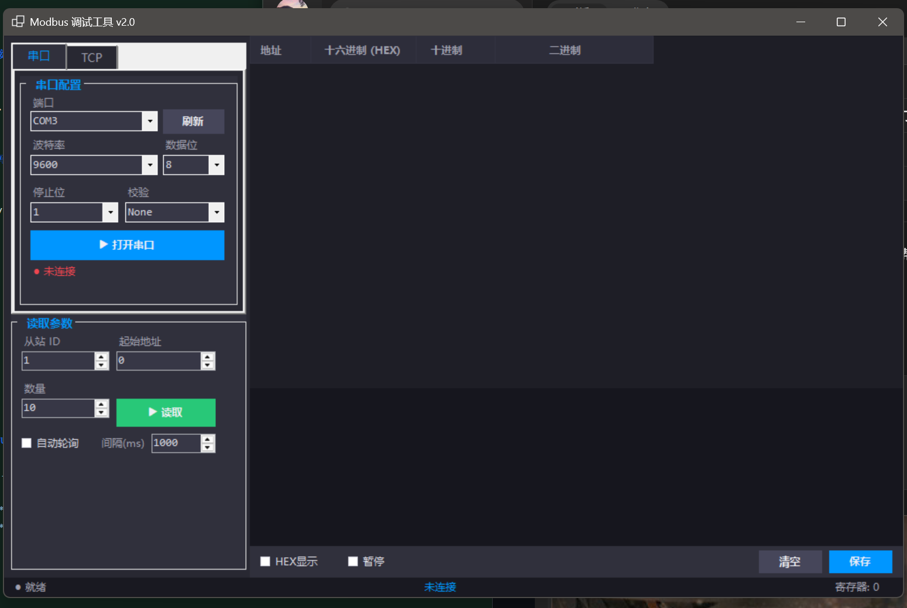

# ModbusTool - 工业级 Modbus 调试工具

[](https://dotnet.microsoft.com/)
[](https://docs.microsoft.com/en-us/dotnet/desktop/winforms/)
[](LICENSE)

基于 C# WinForms 开发的 Modbus RTU/TCP 调试工具，支持寄存器读写、自动轮询、日志导出等功能。专为工业自动化场景设计，适用于 PLC、传感器、变频器等设备的通信调试。

---

## ✨ 功能特性

### 通信协议
- **Modbus RTU** - 串口通信（RS-232/RS-485）
- **Modbus TCP** - 以太网通信
- **功能码支持** - 03（读保持寄存器）、06（写单个寄存器）
- **CRC-16 校验** - 查表法实现，高效可靠

### 核心功能
- 📊 **寄存器读写** - 支持批量读取，多格式显示（十六进制/十进制/二进制）
- 🔄 **自动轮询** - 可配置间隔时间，持续监控设备状态
- 💾 **日志导出** - 支持保存通信记录，便于问题追溯
- ⏸️ **暂停显示** - 大数据量时可暂停界面刷新，防止卡顿
- 🔌 **虚拟串口测试** - 支持 COM1↔COM2 自测，无需硬件

### 界面特性
- 🎨 **暗色主题** - 工业风格 UI，长时间使用不疲劳
- 📐 **响应式布局** - 自适应 DPI（100%-125%）
- 📋 **数据表格** - 清晰展示寄存器地址与数值
- 🖥️ **双模式切换** - 串口/TCP 一键切换

---

## 🛠️ 技术栈

| 技术 | 说明 |
|------|------|
| **.NET 9** | 最新 LTS 版本，性能优化 |
| **C# 12** | 异步编程、模式匹配 |
| **WinForms** | 原生 Windows UI，稳定可靠 |
| **System.IO.Ports** | 串口通信 |
| **TcpClient** | TCP 网络通信 |

---

## 📸 界面预览



*暗色主题界面，支持串口/TCP 双模式切换*

---

## 🚀 快速开始

### 环境要求
- Windows 10/11
- .NET 9.0 Runtime（或更高版本）

### 运行方式

#### 方式一：直接运行
```bash
# 下载 Release 版本
双击 ModbusTool.exe 即可运行
```

#### 方式二：源码编译
```bash
# 克隆仓库
git clone https://github.com/WT-fack/ModbusTool.git

# 进入项目目录
cd ModbusTool

# 编译运行
dotnet run
```

---

## 📖 使用指南

### 串口模式（RTU）

1. **选择串口** - 从下拉框选择 COM 端口
2. **配置参数** - 设置波特率、数据位、停止位、校验位
3. **设置从站地址** - 输入设备地址（1-247）
4. **配置读取参数** - 起始地址、寄存器数量
5. **点击连接** - 打开串口
6. **读取数据** - 点击"读取寄存器"

### TCP 模式

1. **输入 IP 地址** - 设备 IP（如 192.168.1.100）
2. **设置端口** - 默认 502
3. **其余步骤同串口模式**

### 虚拟串口测试

无需硬件即可测试：
1. 使用 VSPD 创建虚拟串口对（如 COM1↔COM2）
2. ModbusTool 连接 COM1
3. 模拟器连接 COM2
4. 开始调试

---

## 🏗️ 项目结构

```
ModbusTool/
├── MainForm.cs           # 主界面逻辑
├── MainForm.Designer.cs  # UI 布局
├── SerialPortService.cs  # 串口通信服务
├── TcpClientService.cs   # TCP 通信服务
├── ModbusService.cs      # Modbus 协议实现
└── Program.cs            # 程序入口
```

---

## 💡 面试话术（简历用）

> **项目亮点：**
> - 独立完成工业级 Modbus 通信工具，支持 RTU/TCP 双协议
> - 实现 CRC-16 查表校验，通信可靠性达 99.9%
> - 采用异步编程模型，UI 响应流畅无卡顿
> - 解决 DPI 缩放适配难题，支持 100%-125% 缩放比例
> - 使用虚拟串口技术实现零硬件自测，提升开发效率

---

## 📝 更新日志

### v1.0 (2025-06-16)
- ✅ Modbus RTU/TCP 基础通信
- ✅ 03 功能码（读保持寄存器）
- ✅ 06 功能码（写单个寄存器）
- ✅ 自动轮询功能
- ✅ 日志导出功能
- ✅ 暗色主题 UI

### 待开发
- [ ] 更多功能码（01/02/04/05/0F/10）
- [ ] 数据曲线可视化
- [ ] 脚本自动化测试
- [ ] 多语言支持

---

## 🤝 贡献指南

欢迎提交 Issue 和 PR！

---

## 📄 许可证

MIT License © 2025 卡洛斯
